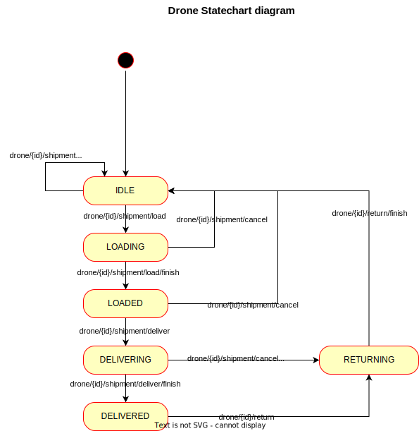
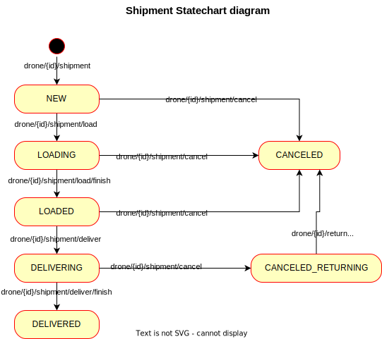

## Install & Deploy

### I. In a Docker container

Run `docker-compose up -d --build` from the folder `drone-manager`

It starts two containers: application (`app`) and postgres db (`db`)

### II. Run locally with in-memory DB

1. Change the next properties in `drone-manager/src/main/resources/application.yml`:
```yaml
spring:
    datasource:
        url: jdbc:h2:mem:testdb;NON_KEYWORDS=value
        driver-class-name: org.h2.Driver
...
```
2. Run `mvn spring-boot:run` from the folder `drone-manager`

## Try it out

Examples for all the endpoints can be found in Postman collection [drone-manager.postman_collection.json](extra/drone-manager.postman_collection.json)

The Swagger UI with OpenApi documentation is available for started application at [/swagger-ui/index.html](http://localhost:8080/swagger-ui/index.html)


## Business logic

1. The max weight limit that can be set for a drone depends on its drone model. The rule is `drone.weightLimit`<=`droneModel.defaultWeightLimit`
2. Minimal battery level for drone loading and fleet size are configurable properties. The configurations stored in DB table `system_property`
3. Shipment has an `addressee` field which is **required** for delivering
4. Shipment has `startDate` and `endDate` fields
5. Shipment has its own state
6. Empty shipments cannot be delivered
7. Shipment can be cancelled in any dynamic state (not delivered, not cancelled)
8. The `serialNumber` value of `drone` is unique and cannot be changed
9. The `name` value of `medication` is unique and cannot be changed

## Roles assumption

1. It is assumed that agent clients (AGENT_ROLE) have permission only for read operations and `drone-dispatcher` API and does not have permission for CUD (create, update, delete) operations
2. It is assumed that manager clients (MANAGER_ROLE) have permission for CUD operations
3. It is assumed that drone clients (DRONE_ROLE) have permission for its drone update operation and are updating their battery level by calling `PATCH /drone/{id}`

## TODO

1. Links for available API calls for shipment/drone by REST
2. Medication image storing
3. Configurable error/info messages (i18n)
4. Search filters for shipments (shipment history)
5. Pagination/sorting for all the `get all` operations
6. Add tests for the rest Services and Controllers

## Statecharts

